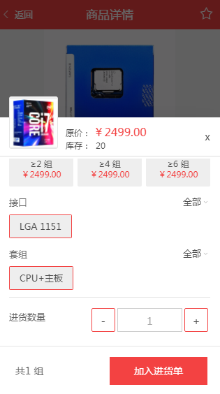
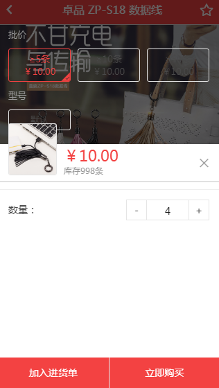
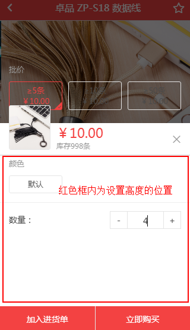

#### 运用ionic+angularjs实现webapp。

在用标签<ion-popover-view></ion-popover-view>实现内容的滚动时，这里出现了问题，内容超出模态框滚动时内容没有隐藏，当然模态框最外层div中并未使用overflow：hidden，因为商品图片需上凸起，所以这里并没有使用overflow：hidden，一开始代码是这样的

```
<ion-content>
    <div class="fourth-cover">
        <div class="prop">
            <header class="prop-header">
                <span>批价</span>
            </header>
            <ul class="clearfix">
                <li class="active">
                    <p><span ng-bind="'≥'+detail[0].priceScopeTitle1">0</span><span ng-bind="detail[0].unit"></span></p>
                    <p ng-bind="detail[0].price1 | currency : '￥'">￥0</p>
                    <i class="icon-select"></i>
                </li>
                <li>
                    <p><span ng-bind="'≥'+detail[0].priceScopeTitle2">0</span><span ng-bind="detail[0].unit"></span></p>
                    <p ng-bind="detail[0].price2 | currency : '￥'">￥0</p>
                    <i class="icon-select"></i>
                </li>
                <li>
                    <p><span ng-bind="'≥'+detail[0].priceScopeTitle3">0</span><span ng-bind="detail[0].unit"></span></p>
                    <p ng-bind="detail[0].price3 | currency : '￥'">￥0</p>
                </li>
            </ul>
        </div>   
    </div>
</ion-content>
```


需要实现效果如下：


<p class="text-center">实现效果</p>

<!-- more -->

##### 这里bug重现如图


<p class="text-center">bug效果</p>


##### 解决方法是这样的

在内容滚动div设置高度,同时给滚动的地方添加ion-scroll标签。实现代码
```
<div class="fourth-cover">
    <ion-scroll direction="y" zooming="false" scrollbar-y="false" class="scorll">
        <div class="prop">
            <header class="prop-header">
                <span>批价</span>
            </header>
            <ul class="clearfix">
                <li class="active">
                    <p><span ng-bind="'≥'+detail[0].priceScopeTitle1">0</span><span ng-bind="detail[0].unit"></span></p>
                    <p ng-bind="detail[0].price1 | currency : '￥'">￥0</p>
                    <i class="icon-select"></i>
                </li>
                <li>
                    <p><span ng-bind="'≥'+detail[0].priceScopeTitle2">0</span><span ng-bind="detail[0].unit"></span></p>
                    <p ng-bind="detail[0].price2 | currency : '￥'">￥0</p>
                    <i class="icon-select"></i>
                </li>
                <li>
                    <p><span ng-bind="'≥'+detail[0].priceScopeTitle3">0</span><span ng-bind="detail[0].unit"></span></p>
                    <p ng-bind="detail[0].price3 | currency : '￥'">￥0</p>
                </li>
            </ul>
        </div>
        <div class="prop">
            <header class="prop-header">
                <span ng-bind="detail[0].paramTitle1">颜色</span>
            </header>
            <ul class="clearfix">
                <li>
                    <p><span ng-bind="">默认</span></p>
                    <i class="icon-select"></i>
                </li>
            </ul>
        </div>
    </ion-scroll>
</div>
```



